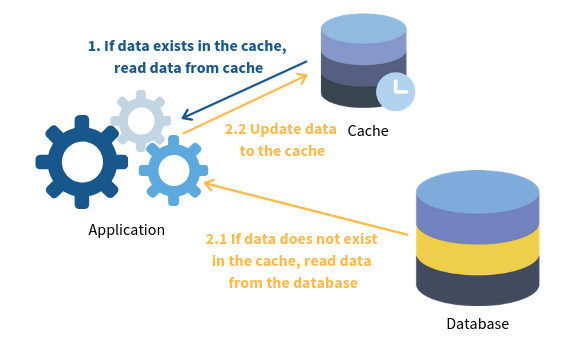
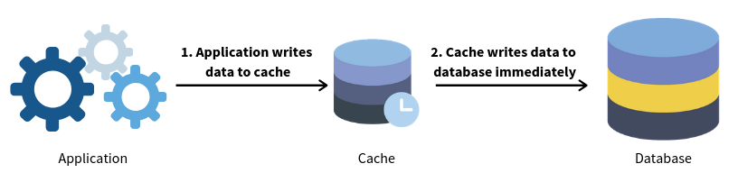
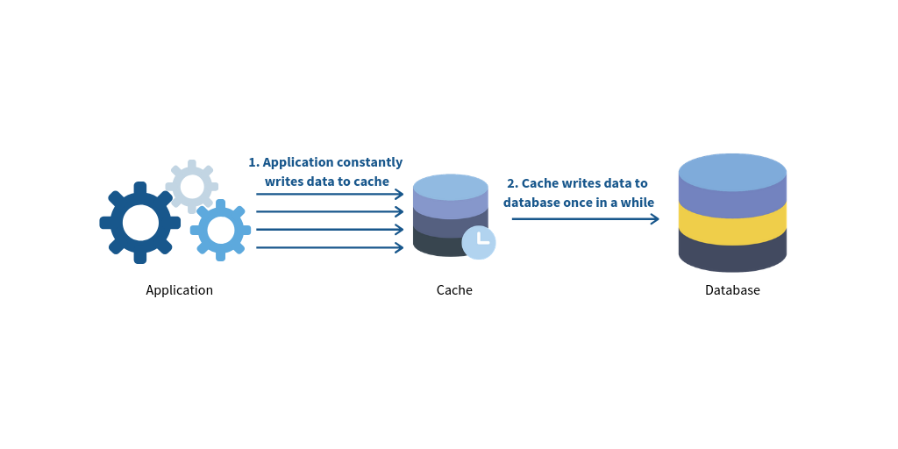

# CACHING

## Table of Content 

- [Introduction](#introduction)
- [Caching Types](#types-of-caching)
- [Caching Strategies](#caching-strategies)
- [References](#references)
- [Benefits of Caching](#benefits-of-caching)

### Introduction 

1.  **What is Caching** 

    In computing, a cache is a high-speed data storage layer which stores a subset of data, typically transient in nature, so that future requests for that data are served up faster than is possible by accessing the data’s primary storage location. Caching allows you to efficiently reuse previously retrieved or computed data

2.  **How Does Caching works**

    A cache's primary purpose is to increase data retrieval performance by reducing the need to access the underlying slower storage layer. Trading off capacity for speed, a cache typically stores a subset of data transiently, in contrast to databases whose data is usually complete and durable.

### Types of Caching

1.  **Database Caching**

    Database caching is a process included in the design of computer applications which generate web pages on-demand (dynamically) by accessing backend databases.
    
    1. *Database Challanges*

        When building distributed applications that require low latency and scalability, there are a number of challenges that disk-based databases can pose to your applications.

        - Slow processing queries
        - Cost to scale
    2. *How Caching helps*

        A database cache supplements your primary database by removing unnecessary pressure on it, typically in the form of frequently accessed read data.Most commnon types of database caching are :
    
        1. Database Integrated Caches :
            - Integrated cache that is managed within the database engine and has built-in write-through capabilities.
        2. Local Caches :
            - Stores your frequently used data within your application.
        3. Remote caches :
            - Stored on dedicated servers and typically built upon key/value *NoSQL* stores such as _Redis_ and _Memcached_.        

2.  **Content Delivery Network (CDN) Caching**

    CDN will reduce the load on an application origin and improve the experience of the requestor by delivering a local copy of the content from a nearby cache edge, or Point of Presence (PoP). The application origin is off the hook for opening the connection and delivering the content directly as the CDN takes care of the heavy lifting.

3.  **Web Caching**

    Web caching is performed by retaining HTTP responses and web resources in the cache for the purpose of fulfilling future requests from cache rather than from the origin servers.

    - Client Side web caching

    - Server Side web caching

4.  **General cache**

    These cache are used to store and retrieve data not suitable for a traditional database in order to efficiently and rapidly respond to a request or compute the response.

5.  **Session Management**

    There are various ways to manage user sessions including storing those sessions locally to the node responding to the HTTP request or designating a layer in your architecture which can store those sessions in a scalable and robust manner. 

    - Sticky Sessions with Local Session Caching

    - Distributed Session Management 

### Caching Strategies

A caching strategy is to determine the relationship between data source and your caching system, and how your data can be accessed.

1.  **Cache Aside**

     In this strategy, the cache is sitting aside the database. The application will first request the data from the cache. If the data exists (we call this a ‘cache hit’), the app will retrieve the data directly. If not (we call this a ‘cache miss’), the app will request data from the database and write it to the cache so that the data can be retrieved from the cache again next time.

    


    Pseudocode
    ```javascript
        app.get('/summary', async (req, res) => {
            // Check the cache
            if (cache.has('summary')) {
                const data = await cache.get('summary');
                return res.json({ data });
            }
            // If no cache, then get data from datastore
            const data = await getSummary();
            // Set the cache for future request
            await cache.set('summary', data);
            // Send the response
            return res.json({ data });
        });

    ```

2.  **Read Through**

    Unlike cache aside, the cache sits in between the application and the database. The application only request data from the cache. If a ‘cache miss’ occurs, the cache is responsible to retrieve data from the database, update itself and return data to the application.

    

    Pseudocode

    ```javascript
    app.get('/summary', async (req, res) => {
    // If no cache exist
        if (!cache.has('summary')) {
            await getSummaryFromStoreAndSetCache();
        }
        const data = await cache.get('summary'); 
        // Always exist at this point
        // Send the response
        return res.json({ data });
    });
    ```

3.  **Write Through**

    Similar to read through, the cache sits in between. Every writes from the application must go through the cache to the database.

    

    Pseudocode

    ```javascript
    // Sample creation endpoint
    app.post('/summary', async (req, res) => {
      const { payload } = req.body;
      // Create cache first
      await cache.set('summary', payload);
      // Send the response
      return res.json({ success: 'Content updated successfully' });
    });

    // Sample updation endpoint
    app.put('/summary', async (req, res) => {
      const { payload } = req.body;
      // Get previous cache and update payload
      const previousCache = await cache.get('summary') || [];
      const data = [...previousCache, payload];
      // Update or overwite cache first
      await cache.set('summary', data);
      // Send the response
      return res.json({ success: 'Content modified successfully' });
    });

    ```

4.  **Write Back (a.k.a Write Behind)**

    It has a similar setup with write through. The application still writes data to the cache. However, there is a delay in writing from the cache to the database. The cache only flushes all updated data to the DB once in a while (e.g. every 2 minutes).

    

5.  **Write Around**

    Write around usually combines with either cache aside or read through strategy. The application writes directly to the database. Only data that is read goes to the cache.

    

### Benefits of Caching

1. Improve Application Performance
2. Reduce Database Cost
3. Reduce the Load on the Backend
4. Predictable Performance
5. Eliminate Database Hotspots
6. Increase Read Throughput (IOPS)


### References

1. [Amazon : Caching Overview](https://aws.amazon.com/caching/)
2. [Caching Strategies to speed up your API](https://blog.logrocket.com/caching-strategies-to-speed-up-your-api/)
3. [Things to know about caching](https://bluzelle.com/blog/things-you-should-know-about-database-caching)
4. [Cache(computing)](https://en.wikipedia.org/wiki/Cache_(computing))
5. [Caching Strategies and How to choose right one](https://codeahoy.com/2017/08/11/caching-strategies-and-how-to-choose-the-right-one)
